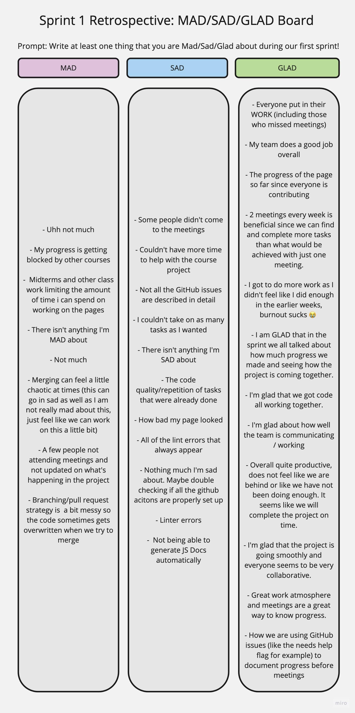

# Meeting 11 (Sprint 1 Retrospective) + Date: 05/24/23

## Attendance
- [X] Haven Ahn
- [X] Amit Namburi
- [X] Fayaz Shaik
- [X] Brian Ton
- [X] Vasil bogdev
- [X] Jose Arreguin
- [X] Botao Zhang
- [X] Prisha Anand
- [ ] Bao Thy Nguyen
- [ ] Wilson Nguyen

## General Agenda
1. Opening
    - Welcome and introduction
    - Review of the meeting agenda

2. Review of Last Sprint
    - What went well?
    - What didn't go well?
    - Any challenges or blockers faced?

3. Used MAD, SAD, GLAD containers to think of the last sprint and every team member gave their opinion on the sprint anonymously.

- This is the Retrospective board we built using Miro.

  
  
## Next Sprint Takeaways

#### Updated Branching Rules 
- Make sure to close and delete any branches that have been successfully pulled to the main branch during the weekly meeting. 
- Only create a new branch for a large change. 
- Ensure that you communicate with team (or pair) when you are working on the branch to avoid conflicts.
- Refer to the meeting notes document to see who has been assigned what task, so you do not accidentally complete another person's part as well. 

#### Updated Standardizing
- Instead of using standard sheet, which causes issues depending on the layout of the page, we can refer to the Figma for exact values. 
- Have one person go through all the pages and work solely on standardizing them (make sure fonts, size, layout, spacing, etc matches). 

#### Updated Attendance 
- Those who miss meetings will have tasks assigned to them on the meeting notes, a Slack message will be sent out as well. 
- Add more detail to notes so those who could not attend in person can understand. 
- Encourage asking clarification questions regarding assigned tasks. 

## Conclusion

- In conclusion, the retrospective meeting provided valuable insights and discussions regarding the last sprint. We identified both positive aspects and areas for improvement. The team discussed various topics, generating action items to implement in the upcoming sprint.
- It is important to realize the importance of communication and attending meetings to know what's happening with the project and team.
- By implementing the things we've learned and realized from this retrospective, we aim to enhance our team's efficiency and deliver higher quality results in the future.

